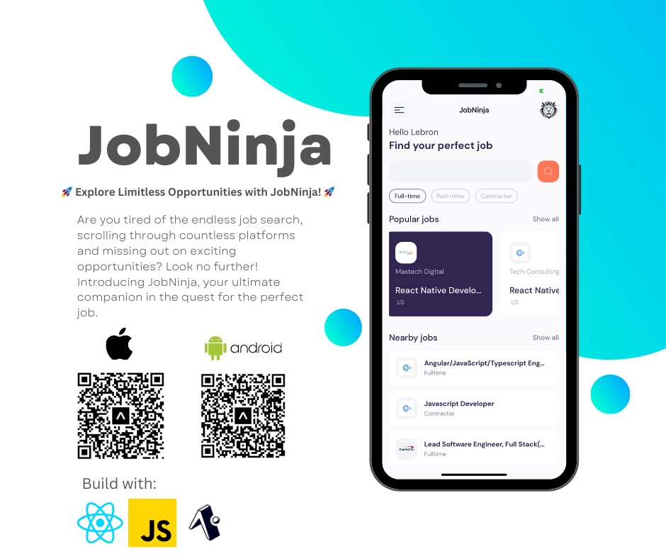

# JobNinja

---

# JobNinja - Your Ultimate Job Search Companion 🚀

Welcome to JobNinja, where your dream job is just a tap away! JobNinja is an innovative mobile app developed using Expo, designed to simplify and enhance your job search experience. Whether you're a seasoned professional or just starting your career, JobNinja has something to offer for everyone.

## Features

-🌟 Seamless Job Discovery: Effortlessly explore a wide range of job opportunities tailored to your skills and preferences.

-📱 Mobile Accessibility: Access job listings anytime, anywhere. JobNinja empowers you to take control of your job search on the go.

-🌐 Diverse Job Categories: JobNinja caters to various industries, providing a diverse array of job categories to suit your career goals.

## Getting Started
1. Clone the Repository: git clone https://github.com/bron322/JobNinja.git
2. cd JobNinja
3. npm start
4. Scan the QR code with EXPO app on your phone
   
Happy job hunting with JobNinja! 🚀✨
